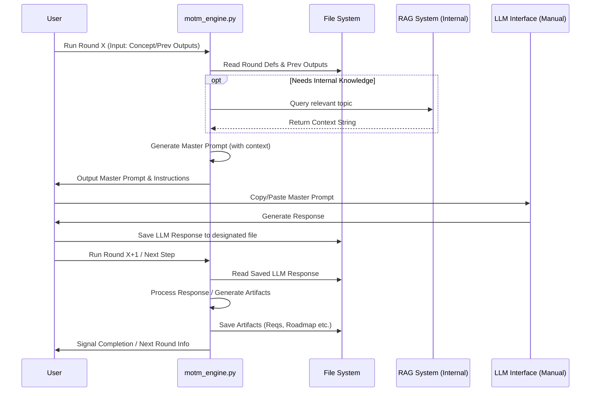

## AI Orchestrator/Architect - Initial Thoughts

**Core Task:** Design a system architecture that orchestrates the multi-round MotM process, primarily using Python scripts and file I/O, respecting the "no direct API call" constraint for the LLM interaction itself.

**Architectural Approach:**

1.  **Central Script (`motm_engine.py`?):** A main Python script responsible for managing the overall flow.
    *   Takes the initial concept (as text or file path) and the number of rounds as input.
    *   Manages the state (current round, expected inputs/outputs).
    *   Calls helper functions/modules for specific tasks.
2.  **Round Definition/Templates:** Need a way to define the structure of each round (e.g., number of steps, types of interactions - analysis, synthesis, artifact generation).
    *   Perhaps JSON or YAML files defining each round's structure, including the master prompt template to use for that round.
3.  **State Management:** The primary state will live on the file system.
    *   Use the established directory structure (`MotM/round-X/`).
    *   Define clear file naming conventions for inputs and outputs of each step within a round (e.g., `round-1/pre-analysis/[persona].md`, `round-1/sme-interviews/[persona].md`, `round-1/sme-group-interview.md`, `round-1/analysis.md`).
4.  **Prompt Generation Module:** Abstract the logic for generating the specific prompt text for each step/round.
    *   Takes the current round definition, previous round outputs (file paths), and the master prompt template.
    *   Injects file paths or commands into the prompt template instructing the LLM what to load/process (this relies on the LLM being able to interpret instructions like "Load and analyze the findings from `round-1/analysis.md`"). *Correction:* Since the LLM can't directly load files, the *script* must load the file contents and inject them into the generated prompt string.
5.  **RAG Integration (Internal):** If the orchestrator script can call `answer_query_with_rag`, this becomes a valuable internal tool. The orchestrator could invoke it when a prompt template requires specific knowledge retrieval *before* generating the final prompt for the user to copy to the LLM.
    *   *Example:* A Round 2 prompt might need context about indexer configuration. The orchestrator script calls `answer_query_with_rag`, gets the context string, and injects *that string* into the Round 2 Master Prompt before outputting it.
6.  **Handoff Mechanism:** The script needs to clearly signal the end of its automated processing for a given round and provide the user with:
    *   The generated Master Prompt for the LLM interaction (either printed to console or saved to a file like `MotM/round-X/prompt_for_llm.md`).
    *   Instructions on where the LLM's output should be saved (e.g., "Save the LLM response to `MotM/round-X/llm_output.md`").
    *   Instructions on how to trigger the *next* automated step (e.g., "Run `python motm_engine.py --round X --step Y` after saving the LLM output").

**Key Considerations:**

*   **Modularity:** Design the orchestrator script, prompt generator, and round definitions as separate modules for maintainability.
*   **Configuration:** Use `brain/configuration.json` for settings like default round definitions, RAG agent paths, etc.
*   **Error Handling:** The orchestrator must handle missing input files from previous steps (e.g., user forgot to save LLM output) or errors during RAG calls.
*   **Idempotency:** Ideally, re-running a step in the orchestrator should produce the same result if the inputs haven't changed (though LLM interaction makes true idempotency impossible).
*   **UX Flow:** How can the back-and-forth between running the script, copying to LLM, saving output, and running the script again be made as smooth as possible within the constraints?

**High-Level Workflow Diagram:**

**Focus:** Define clear interfaces between the orchestrator, file system state, internal RAG (if used), and the manual LLM interaction points. Ensure robust handling of file paths and state transitions.
