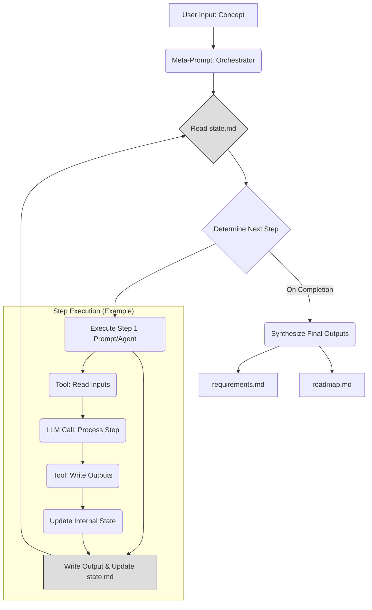

# AI Orchestrator/Architect - Pre-Analysis

**Date:** 2025-04-26

**Concept Analyzed:** Generalizing the 3-monolith MotM prompts into a chained, markdown-based workflow within Cursor, minimizing user interaction and aiming for direct requirement/roadmap outputs.

**Prerequisites Reviewed:** Existing MotM prompts (`round-1` to `round-3`), MVP requirements/roadmap.

**Initial Thoughts & Analysis:**

1.  **Architecture Shift:** Moving from monoliths to a chain fundamentally changes the control flow. Instead of one large prompt managing a phase, we need an orchestrator (likely a meta-prompt or the user acting implicitly via the AI assistant) managing transitions between smaller, specialized prompts (agents/steps).
2.  **State Management:** This is the critical technical challenge. Within Cursor's chat and limited tools, file I/O seems the only viable mechanism. We need a standardized schema for state files (`state.md` or `state.json` within each round's dir?) to pass context, decisions, and intermediate artifacts between chain links. Robustness is low; file corruption, tool errors, or context window limits could break the chain.
3.  **Workflow Design:** How is the chain sequence determined? Is it fixed, or does it adapt based on the concept? An adaptive chain requires complex logic within the orchestrator prompt to select and configure the next step. A fixed chain is simpler but less flexible.
4.  **Modularity vs. Complexity:** Chains offer modularity (easier to update/replace individual steps) but increase orchestration complexity and potential points of failure compared to a single, large context window handling a monolith.
5.  **Tool Integration:** The process relies heavily on file read/write tools. Each step in the chain might need to:
    *   Read the current state file.
    *   Read necessary input artifacts (e.g., previous round's analysis).
    *   Perform its task (e.g., simulate SME discussion).
    *   Write its output.
    *   Update and write the state file for the next step.
    This increases tool call frequency and reliance.
6.  **Reliability & Performance:** File I/O and multiple LLM calls per logical step increase latency and potential for errors. How do we handle failures mid-chain? How do we ensure consistency if a step needs to be retried?
7.  **Security:** Passing state via files requires careful consideration if sensitive information is involved, though less likely for this meta-process concept.

**Conceptual Architecture (Chain):**

**Key Question:** Can a file-based state management system, orchestrated by meta-prompts within the chat interface, provide sufficient reliability and performance for a multi-step, potentially adaptive workflow like the generalized MotM process, given the limitations of the environment (no dedicated scripting, context windows, tool constraints)? 

## Initial Thoughts on MCP for Prompt Servers in Cursor IDE

### System Architecture
- The MCP should be a modular, service-oriented backend (FastAPI, Dockerized) that mediates between the Cursor IDE extension and the Gemini LLM.
- All orchestration logic (prompt assembly, tool invocation, state management) should reside in the backend, with the extension acting as a thin client.
- Use Dependency Injection for testability and maintainability.

### Orchestration Flow
- The orchestrator should manage the ReAct loop: receive user input/context, assemble prompt, call Gemini, parse function calls, execute tools, and return results.
- Maintain a clear API contract (OpenAPI spec) for communication between extension and backend.
- Implement robust error handling and standardized ToolResult objects.

### Tool Integration
- Tools (read_file, insert_code_snippet) should be implemented as async, validated modules with clear schemas.
- Tool execution should be logged and monitored for observability.
- Tool schemas should be the single source of truth for both backend and prompt construction.

### Security
- Enforce strict workspace path validation and least-privilege execution.
- Securely handle API keys and sensitive config via environment variables.
- Avoid exposing unnecessary endpoints or data to the extension.

### Challenges & Opportunities
- Ensuring statelessness or minimal state for scalability.
- Handling context window limitations in LLM calls.
- Designing for extensibility (adding new tools, workflows).

### Open Questions
- How to best manage conversation state across multiple turns?
- What are the best practices for error propagation from tools to the agent and user?
- How to support future multi-agent or multi-tool workflows elegantly? 