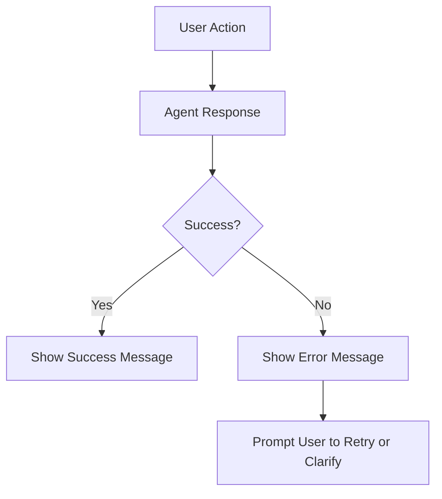

# Research Paper: Meeting of the Minds – MCP for Prompt Servers in Cursor IDE (Round 1)

## Abstract
This paper presents the results of a multi-expert Meeting of the Minds (MotM) process focused on designing a Model Control Point (MCP) for integrating advanced "brain" functionality into Cursor IDE using prompt servers. The process involved a series of structured analyses, interviews, and group discussions among domain experts, culminating in a consensus on the MVP path and open questions for future work.

---

## Table of Contents
1. Introduction
2. Background & Motivation
3. Methodology
4. State Management & Error Recovery
5. Automation vs. Transparency
6. Modularity & Extensibility
7. Security & Reliability
8. User Experience & Trust
9. Consensus & Recommendations
10. Open Questions & Future Work
11. References

---

## 1. Introduction
The integration of agentic, LLM-driven workflows into developer tools like Cursor IDE presents unique challenges. This research explores how to design an MCP that enables robust, extensible, and user-friendly prompt server workflows, with a focus on eliminating copy/paste, ensuring security, and maximizing UX.

## 2. Background & Motivation
Cursor IDE users demand seamless, context-aware coding assistance. Traditional approaches relying on direct model API access or manual copy/paste are insufficient. The MotM process was initiated to synthesize expert perspectives and chart a path toward a prompt-server-based MCP that meets these needs.

## 3. Methodology
The MotM process followed a rigorous, multi-phase structure:
- Pre-analysis by seven SMEs (Prompt Engineer, AI Orchestrator/Architect, Senior Software Engineer, Product Owner, Project Manager, AI UX Engineer, AI Agent Engineer)
- Individual interviews probing challenges, friction points, and solution visions
- Facilitator-led qualitative analysis and synthesis of insights
- Group discussion to resolve conflicts and reach consensus
- Documentation of findings and recommendations

## 4. State Management & Error Recovery
### 4.1. Challenges
All SMEs identified state management as the core technical risk. File-based state (JSON/Markdown) is fragile, especially in a chat-driven, prompt-chaining environment. Non-atomic file writes, context window limitations, and tool failures can corrupt or lose state.

### 4.2. Expert Commentary
- **Prompt Engineer:** Advocates for lightweight, structured state objects and robust validation.
- **SSE:** Recommends versioned state files and backup/rollback mechanisms.
- **AOA:** Suggests treating state as immutable between steps and standardizing error propagation.
- **Agent Engineer:** Emphasizes agent-side validation and user prompts for error recovery.

### 4.3. Recommendations
- Use JSON for state, with versioning and backup.
- Standardize error handling and propagate errors clearly to the user.
- Track error rates and recovery events as key metrics.

#### Example: State Versioning Pseudocode
```python
# Save new state version
with open(f"state_v{version+1}.json", "w") as f:
    json.dump(new_state, f)
```

## 5. Automation vs. Transparency
### 5.1. Challenges
Automation reduces friction but risks making the process a "black box." Removing intermediate artifacts can speed up workflows but may reduce quality and user trust.

### 5.2. Expert Commentary
- **AI UX Engineer:** Users need checkpoints—summaries or optional reviews—to validate progress.
- **Product Owner:** Intermediate artifacts should be optional or summarized, with clear progress updates.
- **Prompt Engineer:** Prompts can generate summaries and request user confirmation at key steps.

### 5.3. Recommendations
- Make intermediate artifacts optional or summarized.
- Provide user checkpoints and progress updates.
- Always require user confirmation for file-changing actions.

## 6. Modularity & Extensibility
### 6.1. Challenges
Supporting future tools, workflows, and agent behaviors requires modular design. Hardcoding logic reduces flexibility and maintainability.

### 6.2. Expert Commentary
- **AOA:** All tools and prompts should be defined in schemas with clear interfaces.
- **SSE:** Dependency injection and modular backend structure are essential.
- **Agent Engineer:** Design for extensibility and future undo/rollback features.

### 6.3. Recommendations
- Use schemas for tools and prompts.
- Modularize backend and agent logic.
- Plan for future extensibility from the outset.

#### Example: Tool Schema (YAML)
```yaml
name: read_file
description: Read the content of a specified file.
parameters:
  file_path:
    type: string
    description: Path to the file
    required: true
```

## 7. Security & Reliability
### 7.1. Challenges
File and tool access, workspace path validation, and least-privilege execution are critical. Security lapses could create liability and erode user trust.

### 7.2. Expert Commentary
- **AOA/SSE:** Emphasize strict path validation and secure config handling.
- **Project Manager:** Recommends involving Security and DevOps experts in future rounds.

### 7.3. Recommendations
- Enforce workspace path validation and least-privilege execution.
- Handle sensitive config via environment variables.
- Involve Security and DevOps SMEs in future design reviews.

## 8. User Experience & Trust
### 8.1. Challenges
Balancing automation with user control, providing clear feedback, and ensuring accessibility are key to adoption.

### 8.2. Expert Commentary
- **AI UX Engineer:** Provide clear indicators of agent actions, allow undo/review, and ensure accessibility.
- **Product Owner:** User trust is paramount; transparency and control are essential.

### 8.3. Recommendations
- Provide progress updates, checkpoints, and clear error messages.
- Involve Human Factors/Accessibility experts in future rounds.

#### Example: User Feedback Flow Diagram (Mermaid)


## 9. Consensus & Recommendations
- Start with a fixed, modular chain for a specific concept type, focusing on robust state management, error recovery, and clear user feedback.
- Use JSON for state, with versioning and backup for recovery.
- Make intermediate artifacts optional or summarized, with user checkpoints at key steps.
- Require user confirmation for all file-changing actions.
- Involve additional SMEs (Security, Test, Human Factors) in future rounds.
- Track error rates, user feedback, and recovery events as key metrics.

## 10. Open Questions & Future Work
- How do we best structure state for reliability and recovery?
- What are the limits of agent autonomy before user trust is impacted?
- How do we ensure extensibility for future tools, workflows, and agent behaviors?
- What are the most likely blockers for each phase, and how do we mitigate them?
- How do we best visualize code changes and context for non-expert users?

## 11. References
- MotM-mcp Round 1 SME Pre-Analysis and Interviews
- MotM-mcp Round 1 Group Discussion Transcript
- MVP Requirements & Roadmap Documents
- Cursor IDE and Prompt Server Documentation 